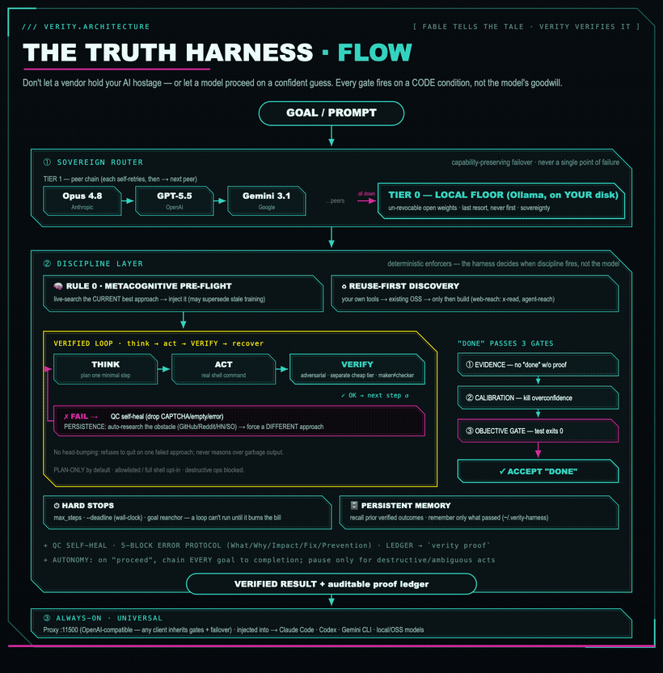
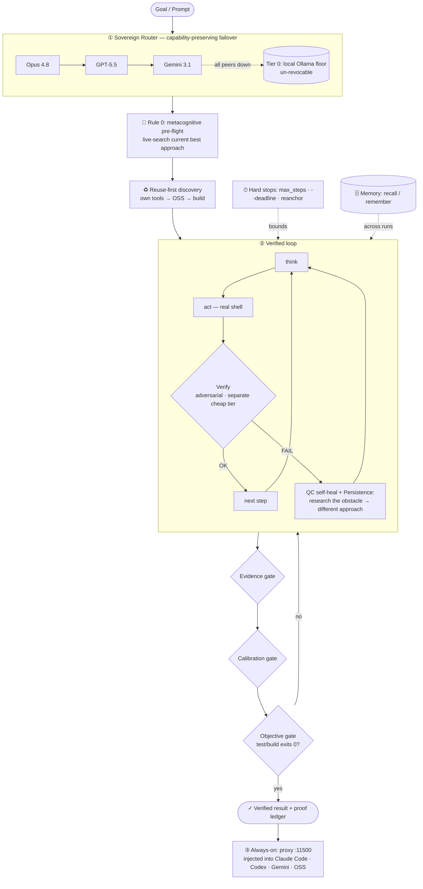

<p align="center">
  
</p>

# VERITY — Architecture & Flow

> **Fable tells the tale. Verity verifies it.**

VERITY wraps *any* model — a frontier enterprise LLM or a 4B you run on a laptop — in a
**discipline layer that fires on code conditions, not the model's goodwill**, on top of a router
that **fails over from a vanished cloud vendor to open weights you own**. This document is the
full walkthrough of how that works, end to end.

The one-sentence version: **a prompt *requests* good behavior; VERITY *enforces* it** — verify
instead of assume, persist instead of quit, reuse instead of reinvent, and prove it with a ledger.

---

## TL;DR — the three stages

| Stage | What it does | Why it matters |
|---|---|---|
| **① Sovereign Router** | Routes to a chain of peer frontier models (Opus 4.8 → GPT-5.5 → Gemini 3.1 …), each self-retrying, then drops to a **local Ollama floor** you own. | A vendor's access can be suspended overnight; it can't reach into weights already on your disk. No single point of failure. |
| **② Discipline Layer** | Pre-flight → reuse-first discovery → a `think→act→VERIFY→recover` loop → a 3-gate "done" funnel → hard stops + persistent memory. | This is the differentiator. Almost nothing else **forces** a model to prove it isn't guessing. |
| **③ Always-on / Universal** | An OpenAI-compatible proxy on `:11500`, plus context-injection into Claude Code / Codex / Gemini CLI / local OSS. | Every agent class inherits the gates + failover transparently. |

---

## Guided walkthrough

<p align="center">
  
</p>

<p align="center"><sub>A spotlight sweeps each stage: goal → sovereign router → discipline layer → verified result → universal distribution.</sub></p>

---

## The pipeline, stage by stage

### ① Sovereign Router — *capability-preserving failover*
Tier 1 is a **chain of peer frontier models**, not one. Each entry self-retries; on hard failure
the router advances to the next peer (`LLM_TIER1_MODELS`, one key via OpenRouter or a local shim).
When every cloud peer is exhausted it drops to **Tier 0** — open weights via Ollama on localhost,
the **un-revocable floor**. Tier 0 is the last resort, never the first: you keep frontier
capability while it's available, and keep *working at all* when it isn't. `verity failover-test`
proves it: point Tier 1 at a dead port and watch the local floor answer.

### ② Discipline Layer — *deterministic enforcers*
Because LLMs are probabilistic, **every behavior below fires on a code condition the harness
controls** — never the model's choice to remember.

- **🧠 Rule 0 · Metacognitive pre-flight** *(fires first)* — before executing, the harness
  live-searches the **current best/established approach** and injects it (*"may supersede your
  training — prefer it"*). The model stops *recalling* from finite, stale weights and starts
  *finding + applying* the current answer. **This is the lever that lets a weaker model punch up** —
  and the lever that fixes a frontier model's post-cutoff blind spots.
- **♻ Reuse-first discovery** — your own installed tools → existing open source → only then build.
  Includes web-reach (`x-read` reads X posts *and* Articles with no key; `agent-reach` routes
  Reddit/YouTube/Bilibili/LinkedIn) so the model uses a battle-tested cascade, not a hand-rolled
  CAPTCHA-prone scraper.
- **The verified loop** — `think → act (real shell) → VERIFY`. Verification is **adversarial** and
  routed to a **separate, cheap tier** (maker ≠ checker: the model that did the work doesn't get to
  grade its own homework). On failure: **QC self-heal** drops garbage output (CAPTCHA/empty/error) so
  the model never reasons over noise, then **Persistence** auto-researches the *obstacle*
  (GitHub/Reddit/HN/StackOverflow) and forces a genuinely **different** approach — no head-bumping,
  no premature quitting.
- **The "done" funnel — three gates** — a claim of completion must survive:
  1. **Evidence gate** — refuses "done" on a fact question with zero verified evidence.
  2. **Calibration gate** — challenges the conclusion: *what unverified assumptions does this rest on?*
  3. **Objective gate** *(opt-in `--gate "<cmd>"`)* — a real test/build/lint must **exit 0**. The
     maker doesn't declare victory; an exit code does. This kills the **Ralph-Wiggum loop** (agent
     emits the completion token on a half-done job) — a passing test beats "a second optimist".
- **⏱ Hard stops** — `max_steps` (always on) + `--deadline` (wall-clock) so a loop can't *"run until
  someone notices the bill"*, plus a periodic **goal reanchor** so long runs don't drift off-goal.
- **🗄 Persistent memory** — recalls prior **verified** outcomes and remembers only what passed
  (`~/.verity-harness/`), so similar goals resume instead of restarting.
- **Auditable** — a decision ledger records which gates fired and what got corrected: `verity proof`.

### ③ Always-on & Universal
Run the OpenAI-compatible proxy (`python3 -m verity.server` → `:11500/v1`) and point any client at
it to inherit failover + gates transparently. For agents that talk to their vendor directly
(Claude Code, Codex, Gemini CLI), the same gate **content** is injected as standing context;
OpenAI-format/local models get it natively through the proxy. One discipline, every agent class.

---

## Flow (GitHub-native, editable)



---

## Why this lifts top-end enterprise LLMs

A frontier model is brilliant and *still* fails in four predictable ways VERITY targets directly:

| Failure mode of a top LLM | The VERITY gate that fixes it | Effect |
|---|---|---|
| **Stale knowledge** — confidently answers from a training cutoff that's months old | Rule 0 pre-flight injects the live current-best approach | Turns the whole internet into the model's knowledge base |
| **Confident wrong answers** — asserts a negative ("no API for that") or a guess as fact | Search-before-concluding + Evidence + Calibration gates | Forces *find*, not *recall*; tags VERIFIED vs GUESS |
| **Self-grading** — the model that wrote the code says the code is fine | Verify on a separate tier + the **objective `--gate`** | A passing test, not an opinion, defines "done" |
| **Runaway / quiet-fail loops** — burns budget, or quits at the first obstacle | Hard stops + persistence + QC self-heal | Bounded cost; no head-bumping; no half-done "done" |

**Reasoning · capability · automation · task-completion — measured, not asserted** (`verity eval`,
`verity tasks`, `verity swebench`):

- **Current-info reasoning:** **Opus 4.8 went 25% → 100%** (+3) — it *cannot* know post-training
  facts; the harness's live search supplies them.
- **Reasoning traps on a small model:** a **4B went 33% → 67%** (+1) — the gates make a weak model
  behave like a more careful one.
- **Automation / multi-step goals:** the verified loop + objective gate + hard stops turn "draft me
  an answer" into "drive this task to a test-passing, evidence-backed completion, autonomously."

**Honest limits (reported straight):** lift depends on the **task**, not just the model. On *easy*
coding bugs a capable model already scores ~100% one-shot, so the harness adds **0 lift and can even
regress −1** (multi-step overhead). VERITY helps where a model **needs** help — current/post-cutoff
info, your specific tools, multi-step verification — not where it already aces the one-shot. Re-run
the suite on your own workload; the ledger keeps everyone honest, including us.

---

## Bulletins — the 60-second version

- **Sovereignty by default.** Cloud chain → local floor you own. A vendor vanishing at 2am is a
  config event, not an outage. (`verity failover-test` proves it.)
- **Discipline fires on code, not vibes.** The model can't *choose* to skip verification — a gate does.
- **Find, don't recall.** Pre-flight + search-before-concluding beat a strong model's stale priors.
- **Maker ≠ checker.** Verification runs on a separate tier; "done" must clear evidence + calibration
  + an **objective test gate** (`--gate`).
- **Bounded & unstuck.** Hard stops (`--deadline`, `max_steps`) cap cost; persistence + obstacle-research
  stop the quitting and the head-bumping.
- **Reads the walled web.** `x-read` pulls X posts & long-form Articles with no API key; `agent-reach`
  covers Reddit/YouTube/Bilibili/LinkedIn — so "I can't read that" stops being a premature negative.
- **Provable.** `verity proof` is the receipt — which gates fired, what got corrected. No events = it
  wasn't used.
- **Universal & zero-dependency.** Pure-stdlib core; one OpenAI-compatible proxy; injected into Claude
  Code, Codex, Gemini CLI, and any local/OSS model.

---

## Try it

```bash
git clone https://github.com/FutronPrime/verity-harness && cd verity-harness
bash setup.sh                                   # Ollama + a local model; no pip needed
python3 -m verity failover-test                 # PROVE: cloud down → local floor answers ✅
python3 -m verity solve "<goal>" --gate "pytest -q" --deadline 600   # disciplined autonomous run
python3 -m verity proof                         # the receipt: which gates fired
```

See [README.md](README.md) for the full feature tour and [`skill/verity/SKILL.md`](skill/verity/SKILL.md)
for the agent-facing playbook.
