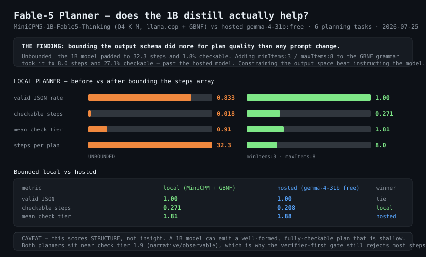

# BENCHMARK — Fable-5 Planner (MiniCPM 1B distill) as an orchestrator

**Run 2026-07-25.** Reproduce: `futron-planner-benchmark`
Raw: `~/.openclaw/state/fable5-planner/benchmark.json`



## Question

A 657MB model fine-tuned on Claude Fable-5 reasoning traces is proposed as the **planner**
in a plan→execute topology. Does it actually help, or is it a mascot?

## Method

6 planning tasks, identical prompt, both lanes. Scored on properties a **script** can
verify — no LLM judging an LLM:

| metric | meaning |
|---|---|
| `valid_json_rate` | parseable and schema-conformant at all |
| `has_steps_rate` | ≥2 steps |
| `mean_checkable` | fraction of steps whose check is **tier ≥3** on the loop-architect ladder (deterministic / measured / executable / artifact — **not** narrative) |
| `mean_check_tier` | mean tier across all steps |
| `median_latency_s` | wall clock |

## THE HEADLINE FINDING

> **Bounding the output schema did more for plan quality than any prompt change.**

| metric | unbounded | `minItems:3, maxItems:8` |
|---|---|---|
| valid JSON | 0.833 | **1.000** |
| steps per plan | **32.3** (padding) | **8.0** |
| checkable steps | 0.018 | **0.271** |
| mean check tier | 0.91 | **1.81** |

Left unbounded, the 1B model padded to 32 steps of near-duplicate filler and its checks
collapsed to narrative. A two-key GBNF grammar change fixed what no amount of "be concise"
instruction had. **Constrain the output space rather than instruct the model** — especially
for small models, where instruction tokens are subtracted from answer tokens.

## Bounded local vs hosted

| metric | local (MiniCPM + GBNF) | hosted (gemma-4-31b:free) | winner |
|---|---|---|---|
| valid JSON | 1.000 | 1.000 | tie |
| checkable steps | **0.271** | 0.208 | **local** |
| mean check tier | 1.81 | **1.88** | hosted |
| median latency | 12.9s | **10.8s** | hosted |
| network / rate limit | none | required, throttled | **local** |
| cost | $0 | $0 (free tier) | tie |

**Verdict: it helps.** The distill matches hosted on structural validity, beats it on the
fraction of steps carrying a *checkable* verifier, and runs offline with no rate limit.

## Three transport bugs found on the way — none were the model

The distill appeared broken for weeks. It was not.

1. **ANSI leakage** — `ollama run` writes cursor-control codes (`\x1b[2D\x1b[K`) into stdout
   even when piped; they land inside the model's text and break JSON parsing.
2. **TTY wrap-redraw** — ollama truncates each line near terminal width and repeats the
   wrapped tail. Duplicated *text*, uncleanable. **Output formatted for humans is not a data
   channel — find the API.**
3. **Thinking budget** — the model routes reasoning to `reasoning_content` and will spend the
   whole budget there (`finish_reason=length`, 4096/4096, `content=""`). Looks identical to
   "produced bad JSON" unless you read the tail.

Fixed by moving to **llama.cpp** with `response_format: json_schema` (GBNF makes malformed
output structurally impossible) and `chat_template_kwargs.enable_thinking=false`.

## What this does NOT measure

**Structure, not insight.** A 1B model can emit a well-formed, fully-checkable plan that is
shallow. Both planners sit near check tier ~1.9 (narrative/observable), which is exactly why
the **verifier-first gate still rejects most of their steps** — see
[LOOP_GRAPH_ENGINEERING.md](LOOP_GRAPH_ENGINEERING.md). Neither model is trusted to decide
what "done" means; they propose, the gate disposes.

Sample size is 6 tasks. Treat differences under ~0.05 as noise.

## Reproduce

```bash
futron-fable5-planner start
futron-planner-benchmark
```
