<p align="center">
  
</p>

<p align="center">
  
  &nbsp;&nbsp;&nbsp;
  
</p>

<h2 align="center">⚡ THE OPEN-SOURCE FABLE ALTERNATIVE ⚡</h2>
<p align="center"><sub><b>frontier-grade discipline on any model you own</b> — zero-dependency · model-agnostic · local-first</sub></p>

<p align="center">
  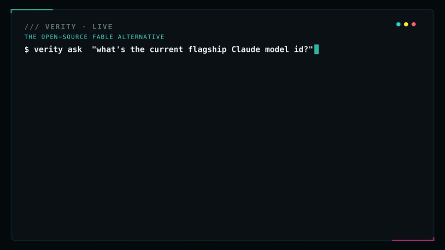
</p>
<p align="center"><sub><b>Caught live:</b> same model — off, it answers from a stale memory; on, VERITY makes it look up the current fact. <code>20%→88%</code>, reproducible.</sub></p>

# VERITY · The Truth Harness

> **Fable tells the tale. Verity verifies it.**  ·  *the Open-Source Fable Alternative.*

*The names were always the tell: a **Fable** is a story that isn't true; a **Mythos** is a myth.
**VERITY** is Latin (`veritas`) for **truth**. They banned the fiction — this is the open-source truth,
and it can't be revoked.*

### The open-source Fable alternative — frontier-grade discipline on models you own.

> **🆕 v2 — Harness Sovereignty Layer:** code executor (`verity-opencode`), new gates (spec-gate, fresh-context verify, tool-veto, durable verdict), reusable `commands/` pipelines, and fully-local keyless routing (Ollama). See **[V2.md](V2.md)** · 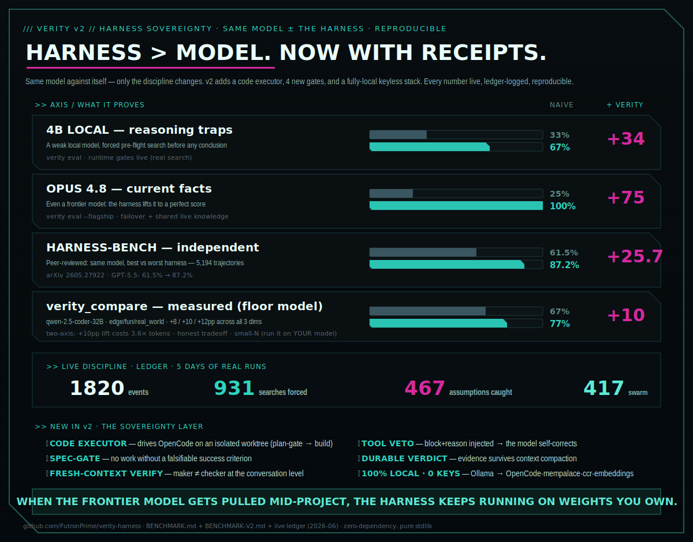

*(model-agnostic · zero-dependency · local-first — the open-source way to get Fable-grade reliability without Fable.)*

Make the models you **own** — a local 8B *or* a frontier flagship — verify, self-correct, and punch
above their weight. Anthropic's **Fable** and **Mythos** can be banned, suspended, or priced out
overnight; VERITY puts that *kind* of disciplined capability into weights **you** control, today.
Measured: across **5 current models** (gpt-4o-mini, gemini-2.5-flash, llama-3.3-70b, qwen3.5-flash,
gemma-4-31b) it lifted current-info accuracy **8% → 91%** — *every* model **+12 to +14**, deterministic
— by forcing one rule: *check your work, adversarially, before you're allowed to say "done."* (That check can run on a separate/cheaper model, or — for a single-model or local-only setup —
the **same** model in a fresh discrimination-mode pass; the bias-free separate model is an opt-in
upgrade, not a requirement. Honest counter-point kept throughout: on tasks a model already aces
one-shot, the lift is ~0 — VERITY helps where a model **needs** help, not where it doesn't.)

**Don't let any single vendor hold your AI hostage — and don't let any model
proceed on confident guesses.** A zero-dependency harness that (1) survives a
vendor vanishing overnight by failing over to open weights you own, and (2)
wraps *any* model in a discipline layer that **forces** it to verify instead of
assume, persist instead of quit, and reuse instead of reinvent.

*Where Anthropic's **Mythos** and **Fable** are named for fiction, **Verity** is
named for truth — and it **verifies**. The name is the thesis.*

> A vendor's access can be suspended overnight. It cannot reach into open weights
> you already pulled to local disk. **That** is sovereignty.

In June 2026 a frontier model was suspended globally with ~3 days' notice. Anyone
who'd built on it as a single point of failure was stuck. This is the answer to
"what happens to my system if my provider vanishes at 2am?" — *and* to "how do I
stop my agent from confidently shipping wrong answers?"

## Two things, both rare

**1. Sovereignty** — automatic, silent failover from cloud → local open weights.
**2. A discipline layer** — verify · evidence-gate · **calibration / anti-overconfidence** · configurable guardrail. This is the differentiator: almost nothing else has an anti-overconfidence gate that makes a model *prove it's not guessing*.

## Autonomy with a spine

VERITY agents don't just *answer* — they **work**, and they **don't give up**:

- **Research before acting** — live-search the current best approach for the exact goal (find, don't
  recall). Stale weights stop being the ceiling.
- **Verify in discrimination mode** — re-checked adversarially by a *separate*/cheaper model, or (single-
  model & local-only setups) the **same** model in a fresh "did this REALLY work? prove it" pass — never
  self-grading in generation mode. "Done" must clear an evidence gate, a calibration / anti-overconfidence
  gate, and (opt-in) an **objective test** that has to exit 0.
- **Self-correct & persist** — on a wall, they research the *obstacle itself* (GitHub / Reddit / X /
  StackOverflow) and force a **different** approach instead of quitting or head-bumping.
- **Automate through blockers** — drive a browser / automation to get past what stops a one-shot call,
  so long, multi-step tasks actually *finish*. ("It's impossible / only a human can" is a **forbidden
  conclusion** until they've actually read the logs, tried the repair, and searched for the fix —
  enforced mechanically by a Stop-hook + a server-side guard, not the model's goodwill.)
- **Know which models exist** — `verity models <provider>` reads the live OpenRouter registry, so the
  harness *looks up* current model ids instead of guessing stale ones from training. ([MODELS.md](MODELS.md))
- **Multi-agent swarm** — `verity swarm` fans out research + execution, runs an adversarial critic, and
  synthesizes — every step gated, **every sub-agent the same caliber as the lead and bound by the same
  gates** (can't quit, can't confabulate model facts). ([details below](#multi-agent-swarm-the-mythosfable-shape--self-contained))
- **Self-improving — it learns from its own track record.** Every gate logs to a decision ledger;
  `verity playbook` mines it for the assumptions the harness *caught being wrong*, the tools it *found*,
  and the fixes that *worked*, and distills an injectable playbook that `autostart` re-feeds **every
  session**. So the model starts each run pre-loaded with its own proven discipline and gets sharper the
  more you use it — *the harness that checks the work also learns from it.*
- **Self-EVOLVING — and it can only get better, never corrupt itself.** `verity evolve` closes the loop:
  it distills a candidate playbook (ledger lessons + recall-promoted memories) and adopts it **only if it
  passes a non-regression gate** — every high-confidence lesson preserved, within budget, valid — with the
  eval suite as an optional held-out fitness check. Candidates are git-archived (rollback without erasure);
  it evolves **playbook text only, never its own code, never the eval**. That gate is the line between
  self-improving and self-*corrupting* — the thing most "self-improving agent" demos skip.
- **Unbounded memory, bounded context** — `verity memory` is a zero-dependency persistent store (stdlib
  SQLite+FTS5) with one guarantee: the block injected each session stays a **fixed budget no matter how
  much you've stored**. Proven, not claimed — injection holds **~270 chars flat from 10 → 10,000 memories**
  while a naive always-loaded index would balloon to ~150k tokens and blow the window. ([details below](#unbounded-memory-bounded-context-verity-memory))
- **Reuse before reinvent — an "infinite resource" library.** `verity resources` is a curated index of
  awesome-lists/frameworks; before building, the harness surfaces *existing* tools to check first (wired
  into pre-flight, zero-cost when irrelevant). REUSE-FIRST as a knowledge base, not a slogan.
- **Enforced, not injected — the discipline BINDS the model.** A rule in the prompt is *probabilistic*: the
  model can read it and ignore it. So the gates that matter fire on **code conditions** — a proxy that
  re-prompts any model on a premature giveup, and a Stop hook that **blocks** ending a turn on a lapse
  (concluding "it's down / not authenticated / only you can" *without* investigating, or publishing without
  the brand screen). [Regression-tested **31/31** adversarially.](#enforced-not-injected--reliability-by-deterministic-gates)

This isn't a personality prompt asking the model to be diligent; it's enforced on **code conditions**.

**Docs:** [Install & requirements](INSTALL.md) · [Guide — purpose, features & best practices](GUIDE.md) · [Model registry](MODELS.md) · [Benchmarks](BENCHMARK.md) · [VERITY vs Sakana Fugu](docs/FUGU_PARITY.md)

## Standalone · additive · a supercharger (not a stopgap)

**Works on a fresh clone with nothing but Python 3.9+ and a model key.** No special models, no daemons,
no preset rules, no private memory or context required. `git clone && python3 -m verity ask "hi"` and
you have the *full* capability set — failover, swarm, verification gates, the live model registry,
research/social-search, web scraping, browser/CUA automation, the anti-giveup guard, and the demo.
(If you happen to have richer tools installed — any `*-scrape`, NotebookLM, a CUA stack — VERITY
auto-detects and prefers them; absent, it falls back to its own stdlib tools. Nothing is required.)

**Additive — it plays well with whatever you already run.** VERITY is an OpenAI-compatible proxy
(`:11500`) + injected gate files (`CLAUDE.md` / `AGENTS.md` / `GEMINI.md`) + a CLI. It doesn't take
anything over. Point OpenClaw, Hermes, Pi, Paperclip, or your own orchestrator/dashboard at the proxy
(or don't); the gates inject into agent config files *additively*; the only port it claims is `:11500`
(configurable). It sits alongside your stack as a discipline layer, not a replacement for it.

**Future-proof — gates ANY agent, however it ships.** `python3 -m verity autostart --universal` wires
the gates into the whole known ecosystem at once — Claude Code (rules + Stop hook), Codex (`~/.codex/
AGENTS.md` + `hooks.json` Stop hook; Codex speaks the Responses API so it's gated by rules+hooks, not
the proxy), Gemini, Cursor, Windsurf, Aider, Cline/Roo, opencode, Zed — plus a generic `AGENTS.md`
fallback (the emerging cross-agent standard) and the **skill installed to every skills dir**
(`~/.claude/skills`, `~/.agents/skills`, …). A new agent next year that reads `AGENTS.md` or
`~/.agents/skills` is *already* covered; otherwise it's a one-line add. Three enforcement layers —
the rules file (always-on doctrine), hooks (mechanical Stop-gate where supported), and the proxy
floor — so the discipline lands no matter how a given model or vendor exposes itself.

**A supercharger, not a stopgap — useful even after Fable comes back.** VERITY's value isn't "be smart
for you"; it's the *innate discipline* it forces on **any** model: the multi-agent swarm, adversarial
verification, making the model check its own work, and proactively searching / trend-scanning /
scraping / automating / taking CUA actions like a human would to actually finish a goal. So when Fable
5 returns, or OpenAI / Google / the open-source world ship their own frontier models, VERITY
**supercharges those too** — *a frontier model + VERITY beats the same frontier model alone.* It's a
permanent force-multiplier on whatever the best available model is.

**Dogfooded — built by its own discipline, and it improves itself.** This repo was largely *built and
hardened by an AI agent running under VERITY's own gates* — every feature added, tested, and corrected
with the same search-before-concluding / verify-before-done / read-the-registry discipline it ships. The
mascot app, the benchmarks, the registry lookup, the swarm — VERITY building VERITY. And it has a real
**self-improving loop**: `verity playbook` mines the harness's own decision ledger (the assumptions it
caught, the tools it found, the fixes that worked) and distills an injectable playbook that `autostart`
re-feeds every session — so each run starts pre-loaded with its *own* proven disciplined behavior, and
the system gets sharper the more it's used. The harness that checks the work also learns from it.

> **The discipline layer for the meta-harness era.** The hard lesson of 2026 (sharpened by the Fable
> ban): *the harness matters as much as the model — maybe more.* "Meta-harnesses" now orchestrate
> several agents together (one implements, another reviews). VERITY is the **reliability layer that
> makes any of them trustworthy**: it injects the same gates into Claude Code, Codex, and Gemini, and
> gates every OpenAI-format agent through the `:11500` proxy — so whether you run one agent or a whole
> pyramid of them, none gets to confidently ship a guess or quit on a wall. If the model can't get
> better, you make the system around it stronger. That's the whole bet.

## 100% self-contained

- **Zero pip dependencies.** Pure Python stdlib. The thing that protects you from
  a vendor being yanked must not break because a PyPI package was yanked.
- **One-command setup.** `bash setup.sh` installs [Ollama](https://ollama.com) +
  pulls a local model (your sovereign floor) and detects any cloud key. No other
  system, account, or service required.
- **Runs fully local** if you have no cloud key at all. That's the point.

```bash
git clone https://github.com/<you>/verity-harness && cd verity-harness
bash setup.sh                              # installs Ollama + a model; no pip needed
python3 -m verity tiers         # show routing order
python3 -m verity failover-test # PROVE: cloud down → local floor answers ✅
```

Optional cloud tier (frontier-class while available): `export LLM_TIER1_API_KEY=<key>`
(OpenRouter gives one key → hundreds of models).

### Works off ONE model (you don't need every provider)

VERITY does **not** require accounts on multiple LLMs. Set just `LLM_TIER1_*` to a **single model** and the
full discipline still runs — the same model self-checks its own conclusions (the verify + humility/calibration
gates fire in self-check mode). Easiest zero-cost path: a **free Gemini API key**
([aistudio.google.com/app/apikey](https://aistudio.google.com/app/apikey); the free `-flash` tier is generous):

```ini
LLM_TIER1_URL=https://generativelanguage.googleapis.com/v1beta/openai
LLM_TIER1_MODEL=gemini-3-flash-preview
LLM_TIER1_API_KEY=YOUR_FREE_GEMINI_KEY
```

Have a second provider? Add `LLM_VERIFIER_MODEL` (a *different* brain) for cross-model challenge — see below.
A ready-to-edit template ships as [`verity.env.example`](verity.env.example).

### Wire YOUR brain once — `~/.verity-harness/verity.env`

No env-export juggling. Drop your tier wiring in `~/.verity-harness/verity.env` (loaded automatically; real
env vars still win):

```ini
LLM_TIER1_URL=<your OpenAI-compatible endpoint>   # workhorse
LLM_TIER1_MODEL=<model id>
LLM_TIER1_API_KEY=<key or "not-used">
LLM_VERIFIER_MODEL=<a DIFFERENT model>            # the cross-examiner (see below)
```

**Frontier on a flat-fee subscription (no metered API):** if you already pay for ChatGPT Plus / Claude Max /
Google AI, run a tiny localhost shim that subprocess-calls your `codex` / `claude` / `gemini` CLI and exposes
it as one OpenAI-compatible endpoint — then point a tier at it. Zero per-token cost. Tip: put your
*token-generous* sub as the workhorse `TIER1`, and reserve a stingier one (e.g. Claude's tighter allowance)
as the sparing `VERIFIER`.

### Cross-model ensemble — beat any single model

The calibration/humility gate runs a **challenger** against every confident conclusion. Set
`LLM_VERIFIER_MODEL` to a **different frontier brain than the workhorse**, and that challenger *cross-examines*
the workhorse's answer — two frontier models catching errors **either one alone would ship**. A single model
can't do that; an ensemble can. It fires sparingly (≈1 call per conclusion), so the strong challenger costs
little. Leave `LLM_VERIFIER_MODEL` unset and it degrades to same-model self-check.

### Latency: put the WORKHORSE on a fast endpoint

The workhorse runs on **every step**, so its per-call latency dominates long-horizon goals. Subscription-CLI
shims (subprocess-spawning `codex`/`claude` per request) are flat-fee but slow — measured **~18s/call** here vs
**~2–3s** for a real HTTP API. So for multi-step builds: point **`LLM_TIER1` (workhorse) at a fast direct API**
and keep the slow flat-fee shim for the **sparing verifier + failover** only (they fire ≈once per conclusion,
so their latency is amortized). Measured 6× per-step speedup. Pick a workhorse model that returns content
directly — *thinking* models (e.g. some `-pro` previews) can exhaust a small token budget on reasoning and
return empty; a `-flash` or a content-returning `-pro` is the safe workhorse.

## Architecture

<p align="center">
  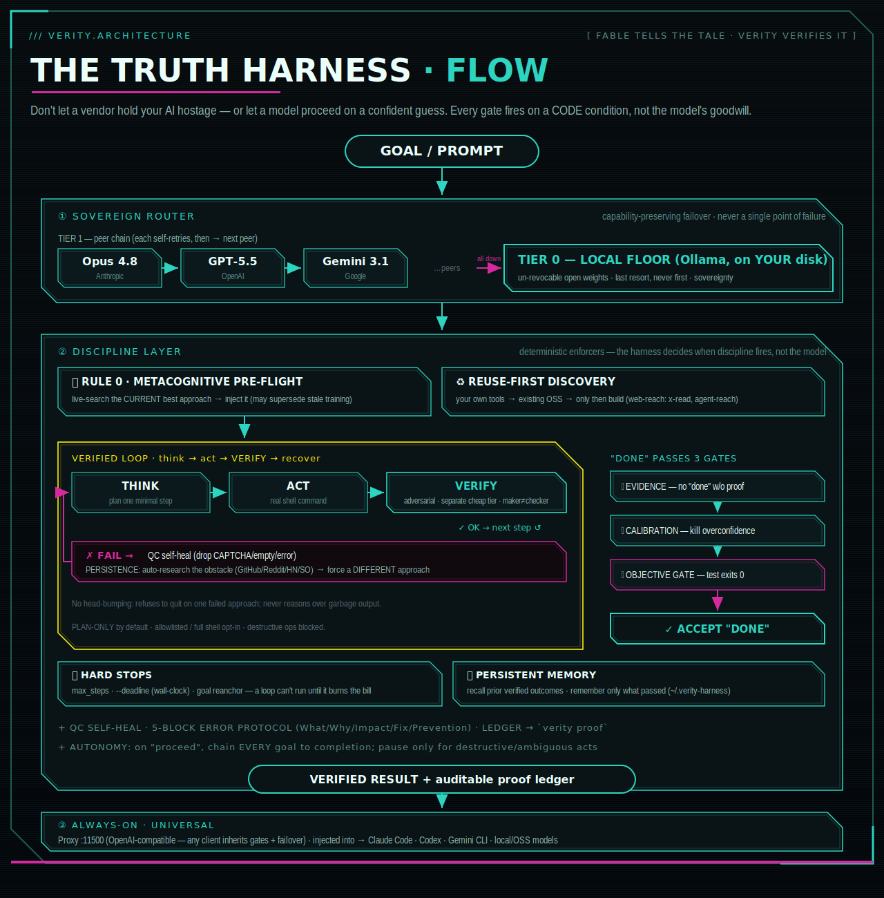
</p>

> 📐 **Full walkthrough:** [ARCHITECTURE.md](ARCHITECTURE.md) — stage-by-stage breakdown, an editable
> Mermaid flow, how it lifts top-end enterprise LLMs (with measured numbers + honest limits), and bulletins.

```
TIER 1   a CHAIN of peer frontier models      ← capability-preserving failover
   │     Opus 4.8 → GPT-5.5 → Gemini 3.1 …        (LLM_TIER1_MODELS, one key via
   │     each self-retries, then → next peer       OpenRouter or a local shim)
   ▼     all peers exhausted → drop to floor
TIER 0   open weights via Ollama (localhost)  ← SOVEREIGN FLOOR, un-revocable
         llama3.2 / qwen2.5 / deepseek on YOUR disk     (last resort, never first)

        ── wrapped in the metacognitive discipline layer ──
   PRE-FLIGHT (research current best approach) → think → act → VERIFY →
   recover → CALIBRATE (challenge before concluding) → SEARCH-before-any-"can't"
   + persistent memory across runs   + decision ledger (auditable receipt)
```

> **The core idea:** it's not a smarter model — it *forces a mediocre-but-capable model
> to behave like a great one.* Before acting, it makes the model admit what it doesn't know
> and **go fetch the current best answer from the live world** (GitHub/Google/Reddit/X/YouTube).
> Mythos/Fable felt like magic because they *reliably did the right thing*; this makes the
> right thing **non-optional** (the gates fire on code, not the model's goodwill) and
> **measurable** (`verity proof` + `verity eval`).

## The discipline layer (why it's different from "just route to an LLM")

<p align="center">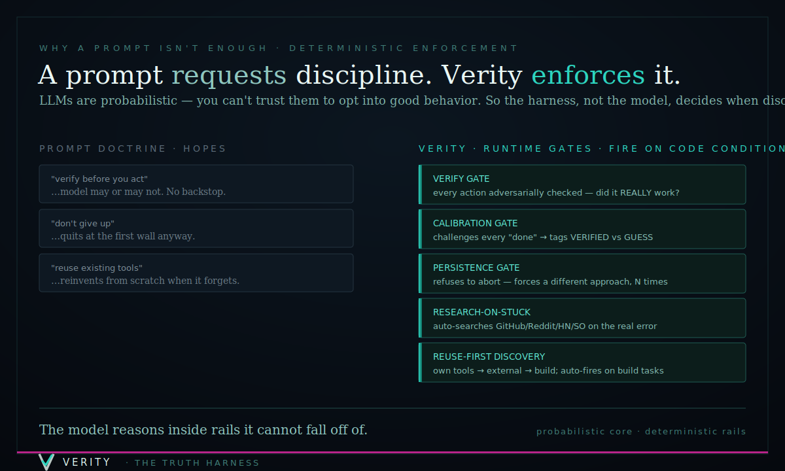</p>

**A prompt *requests* discipline; a gate *enforces* it.** Because LLMs are
probabilistic, every behavior below fires on a *code condition* the harness
controls — never the model's choice to remember.

```python
from verity.scaffold import run_verified
from verity.loop import ShellExecutor

r = run_verified("find and fix the off-by-one bug in utils.py",
                 executor=ShellExecutor())   # think→act→verify→recover→calibrate
```

- **🧠 Metacognitive pre-flight gate** *(fires first)* — before executing a goal, the harness
  live-searches the **current best/established approach** and injects it (*"may supersede your
  training — prefer it"*). The model stops *recalling* from finite, stale weights and starts
  *finding + applying* the current best answer. **This is the lever that lets a weaker model
  punch up** — pinpoint live world-knowledge beats a stronger model's old priors. It turns the
  whole internet into the model's knowledge base.
- **🔎 Search-before-concluding gate** — a *negative* claim ("there's no X", "not possible",
  "no free option") is the most expensive assumption. Before any such claim stands, the harness
  forces a search where solutions live. *(Live example: "X has no free posting API" → forced
  search → `twikit`, which posts free. The model had asserted the opposite from memory.)*
- **Spec pre-flight** — before stepping, the goal is pinned to an **objective done-criterion** (a measurable
  stop, *not* "looks good"/"until satisfied"), a **task-matched verification** (run a test / compare stdout /
  screenshot+inspect / check flow), and **surfaced assumptions** (the goal's ambiguities). A loop is only as
  good as its done-check — this sets a checkable one up front. (Auto for non-trivial goals; `spec=` to force/skip.)
- **Verify gate** — after each action, an adversarial check: *did this really work?*
  Catches failed commands an optimistic loop would rubber-stamp.
- **Evidence gate** — refuses to declare "done" on a fact question with zero
  verified evidence. No answering from vibes.
- **Calibration gate** — before accepting a confident conclusion, challenges it:
  *what unverified assumptions does this rest on, and what would make it wrong?*
  Routes the check to a cheap model (verification is discrimination, not generation).
- **Memory** — remembers verified outcomes across runs (`~/.verity-harness/`),
  surfaces "you've done something like this before."
- **QC self-heal** — tool results are quality-checked: garbage (CAPTCHA/empty/error) is
  *dropped* instead of fed to the model as "findings", and a 5-block ErrorHandlingProtocol
  (What/Why/Impact/Fix/Prevention) journals every failure so the harness fixes its own plumbing.
- **Autonomy gate** — once told "proceed / do this / do all of this", execute EVERY stated goal
  consecutively and autonomously to completion; don't stop to re-ask for confirmation (it wastes
  the user's time). Pause only for genuinely destructive, ambiguous, or outward-facing actions.
  (Injected as standing context for Anthropic-format agents that can't route through the proxy.)
- **Objective completion gate** *(opt-in: `solve --gate "<cmd>"`)* — when you supply a real
  test/build/lint command, **`done` is rejected until that command exits 0**. The maker doesn't get
  to declare victory — an exit code does. This is the *loop-engineering* lesson in code: a stop
  condition that's an LLM opinion is "a second optimist"; a passing test is a gate. Defeats the
  **Ralph-Wiggum loop** (agent emits the completion token on a half-done job).
- **Hard-stop gate** *(`solve --deadline <seconds>`, plus the always-on `max_steps` iteration cap)* —
  a loop with no kill-switch "runs until someone notices the bill." Wall-clock + iteration give two
  of the three classic kill-switches (the third, token budget, is the tier layer's job). Long runs
  also get a periodic **goal reanchor** so constraints don't drift away over many steps.

## Enforced, not injected — reliability by deterministic gates

Most "disciplined agent" projects inject rules into the prompt and hope. That's **probabilistic** — the
model can read "don't conclude a negative without investigating" and do it anyway (we have the receipts:
it happened repeatedly while *building* this). You cannot make a probabilistic system reliable by asking
it harder. The catchable lapses have to be **enforced on a code condition.**

VERITY's enforcement points fire whether the model cooperates or not:
- **Proxy** (`verity/server.py` + `verity/guard.py`) — inspects every model *response* and re-prompts on a
  premature giveup. Universal for any model through `:11500`.
- **Stop hook** (`hooks/stop_guard.py`) — **blocks** ending a turn on a lapse when the evidence trail is
  missing. It catches four classes, each only when the justifying step is absent:
  1. **Unverified negative** — "it's down / broken / not authenticated / not configured" without reading
     logs, attempting a repair, or **querying the tool's own status** first.
  2. **Workaround redirect** — "the clean path is X instead / I'll fall back to…" without that investigation.
  3. **Premature deferral** — "only you can / you'll have to" without trying the automation stack.
  4. **Publish without screening** — posting outward-facing content before the brand/persona screen ran.

### The reliability engine: lapse → gate (monotonic hardening)
Every probabilistic failure becomes a deterministic gate: **name the pattern → add the gate (evidence-gated,
so it never punishes correct work) → log it → test it.** Each repeatable error can happen ~once, then it's
mechanically unrepeatable. The gates are **regression-tested adversarially — `python3 tests/test_stop_guard.py`,
31/31** across many phrasings of each lapse, plus false-positive guards (a properly-investigated conclusion,
a completed screen, normal completion all pass through). What *can't* be coded (taste, novel judgment) stays
probabilistic — but the moment a judgment-lapse becomes a *pattern*, it gets promoted to a gate.

> **The loop, caught on camera (a real example from building this).** The agent built the first version of
> the gate from *one* lapse it had just committed. Then an **adversarial test** was written — many phrasings
> of the same lapse — and it surfaced **4 gaps the agent couldn't see**: it caught "not authenticated" but
> *not* "credentials are missing"; "isn't configured" but *not* "isn't reachable"; the gate let
> "I'll use the browser **instead**" slip through. The test made the blind spots **visible**, they were
> patched, and the suite went 27/31 → **31/31**. That's the whole thesis in one sitting: a probabilistic
> agent can't be trusted to notice its own blind spots — but a deterministic test *can*, and every gap it
> finds becomes a gate that can't reopen. The system got more reliable by being **adversarial with itself**,
> not by trying harder.

### R60 — the persistence gate (the *quit* failure-mode, made un-rationalizable)

The deepest version of "the model can do it but stops anyway." Capability is rarely the bottleneck in
2026; **quitting** is — a capable model hits friction, retries the *same* dead path twice, and emits
"I can't / it's blocked / let's wait for you" when the answer was one real search away. RULE 6/7 said
"don't" and got rationalized past anyway. So R60 makes it a **code condition**:

```bash
python3 -m verity persist "I couldn't fix the 404, let's wait for compact"   # → 🛑 BLOCKED (exit 2)
python3 -m verity persist note github "SearchTimeline 404 fix" "twscrape XClIdGen has it"  # log a receipt
python3 -m verity persist "tried 7 ways first — here's the verified fix"      # → ✅ PASS (EARNED)
```

A conclusion containing quit-language is **blocked** unless the ledger proves real research — **≥3 of
six sources** (GitHub / X / Reddit / YouTube / Google / HN-SO) searched, the **maintained alternative's
source read and reused**, **≥2 structurally different attempts** (re-running one dead path N times does
*not* count) — **or** a genuine human gate is named (password / 2FA / CAPTCHA / payment / account-
creation / destructive). Deterministic and model-agnostic, so it gives **any** model — including a small
open-weight one behind the `:11500` proxy — the persistence that makes frontier models *feel* smart.
Regression-tested (`python3 tests/test_persist.py`, 5/5, encoding a real 2026-06-28 lapse permanently).
Full writeup: [docs/PERSISTENCE-GATE.md](docs/PERSISTENCE-GATE.md) · worked example:
[docs/x-scraper-resilience.md](docs/x-scraper-resilience.md).

### Council-mode — high-stakes eval with blind peer-ranking

For irreversible / high-consequence decisions, one model's answer isn't enough. `verity council`
(ported from [karpathy/llm-council](https://github.com/karpathy/llm-council), researched from the
X-bookmark assimilation matrix) runs three stages on VERITY's own sovereign tiers: **(1)** each
distinct-model tier answers → **(2)** each ranks the *others* with identities **anonymized** (the bias
fix VERITY's prior panel+judge lacked — a model can't favor its own answer it can't see) → **(3)** the
chairman synthesizes from the Borda-aggregated consensus. Rank variance becomes a **disagreement score**
(≥0.5 ⇒ escalate, don't ship).

```bash
python3 -m verity council "Should we route model X for trading-signal synthesis?"
```

Regression-tested (`python3 tests/test_council.py`, 4/4 — including a test that asserts **no identity
leaks into the blind-ranking prompt**). Writeup + provenance: [docs/COUNCIL-MODE.md](docs/COUNCIL-MODE.md).

## Reading the walled web (X posts & Articles, no API key)

The search-before-concluding gate is only as good as the agent's *reach*. "I can't read that page"
is usually a premature negative — so VERITY ships a real reader:

```bash
python3 -m verity x-read "https://x.com/<user>/status/<id>"   # tweet OR long-form Article
python3 -m verity x-read "https://x.com/i/article/<id>"        # the bare article permalink
```

- **Status form** (`/<user>/status/<id>`, `/i/status/<id>`, bare id) → read **fully, no auth, no
  key** via the FxTwitter mirror. Long-form Articles included (their body lives in
  `article.content.blocks`, not the empty `text` field — auto-extracted). This is ~95% of shared links.
- **Bare article permalink** (`x.com/i/article/<id>`) → the article id isn't a tweet id and has **no**
  no-auth path (verified across 7 backends). So VERITY reads it through **your own logged-in browser
  session**: it auto-discovers the X cookie (env `TWITTER_AUTH_TOKEN`+`TWITTER_CT0` → config →
  decrypted from Chrome, **scanning every profile**) and renders the page in a cookie-injected
  headless browser. Cookies stay **local — nothing is uploaded**. With no session it returns an
  *honest, actionable* next step (paste the status URL, or log in) — never a bare "unreadable".

This render path is the **one optional extra** (Playwright + cryptography). The core stays
zero-dependency; enable the reader once with:

```bash
python3 -m verity web-setup      # installs Playwright + Chromium into an isolated venv
```

VERITY auto-detects that venv and runs the render **out of process**, so the harness itself stays
pure-stdlib. (For other walled platforms — Reddit, YouTube, Bilibili, LinkedIn — pair with
[Agent Reach](https://github.com/Panniantong/Agent-Reach), a multi-backend router VERITY surfaces
via `system_web_tools()`.)

## Watch a video — assimilate it for intel (`verity assimilate`)

Reading the web is one input; the one an agent normally *can't* take is a **video** — and "it has no
captions" is **not an excuse to skip it** (RULE 7). Gemini is multimodal: hand it a public URL and it
**watches** the video (visuals + on-screen UI + audio). Built-in, zero-dependency, works on a **free** Gemini
key:

```bash
verity video "<url>"             # full verbatim transcript (no captions needed)
verity video "<url>" --summary   # structured brief (thesis, steps, commands shown, takeaways)
```

`verity assimilate` builds on the same engine for a richer "scout + watch + report" flow:

```bash
verity assimilate watch "<url>" --intent "break down the hook"   # see + hear one video
verity assimilate digest --budget 2                              # scout your channels → daily brief
```

Four stages, triage-first so a channel backlog can't burn your budget:

- **Scout** — poll YouTube channels via RSS **and the `/streams` tab** (the RSS feed misses
  livestreams — a creator's entire LIVE output can be invisible to it). No API key.
- **Filter** — score new videos against your learning goals. Deterministic by default (instant, zero
  tokens); `--smart` for LLM triage.
- **Assimilate** — *see* it: scene-change frames for an agent to read directly
  (built on [claude-watch](https://github.com/taoufik123-collab/claude-watch)), **or** headless
  **Gemini multimodal** that reads on-screen content and hears the audio — cheap enough to schedule.
- **Synthesize** — a structured brief (TL;DR, key moments, what was shown, entities, takeaways) into
  bounded memory.

Plus `assimilate listen --mode performance` (Gemini *hears* singing / comedic timing / emotion that a
text transcript drops) and `assimilate persona <video> --name X` (a structured **Digital Double**
dossier — looks, voice, mannerisms — for faithful recreation). Wire `digest` to a daily scheduler and
you wake up to a budgeted brief of everything worth your time across your channels. Full guide:
[`docs/ASSIMILATE.md`](docs/ASSIMILATE.md).

## Multi-agent swarm (the Mythos/Fable shape — self-contained)

A single disciplined model is good; a **swarm of specialized disciplined agents** is the shape
that frontier agentic systems get their power from. VERITY ships it natively, **zero external
dependencies**. Every sub-agent is **assimilated, not downgraded** — it runs through the **same tier
as the lead** (Opus→Opus, a local 4B→4B, the critic often sharper than the original — the
Agent-Smith property), and inherits the **full discipline stack**: `PRIME_DIRECTIVE` + a reiteration
that it must not quit/defer/hedge and must read the registry for model facts, plus the **same
overconfidence/anti-giveup guard the main loop uses** (a sub-agent that tries to punt is re-prompted,
not allowed to). For model-id questions it reaches the **authoritative registry** too, so sub-agents
share the lead's knowledge access — no confabulated "Kimi V4." Each agent is a role-prompted call,
but bound by every gate:

```bash
python3 -m verity swarm "research and recommend the best approach to X"   # add --exec for real shell
```
```
PLAN  →  decompose the goal into independent sub-tasks
  ↓      (parallel — one worker per sub-task)
RESEARCH → pre-flight live-search the current best approach
EXECUTE  → do it under verify + QC gates
CRITIQUE → an adversarial CRITIC agent reviews; one repair pass on issues
  ↓
SYNTHESIZE → combine the verified sub-results → final answer (VERIFIED vs GUESS tagged)
```
Every step is gate-disciplined and logged to the ledger. A fresh `git clone` runs the full swarm
with **no knowledge of any private tooling** — that's the point: same system, same results, for
anyone who installs it.

## Unbounded memory, bounded context (`verity memory`)

Every agent hits the same wall: knowledge grows toward infinity, the context window doesn't. The usual
"fixes" — a big `CLAUDE.md`, a flat memory file you keep trimming — just move the cliff. A flat index
loaded every session is **O(memories)**; it *will* overflow. Trimming is a treadmill.

VERITY's answer is structural — **the loaded context stays O(categories); the store grows O(∞) behind
retrieval.** Four tiers:

| Tier | What | Grows? | Loaded |
|------|------|--------|--------|
| **0 — Root** | always-on rules + ~6–10 category pointers + infra | **never** | every session |
| **1 — Category index** | `INDEX-*.md`, capped, auto-rollup DONE/PARKED | slowly | on demand |
| **2 — Topic files** | the detail | unbounded count | lazy, when relevant |
| **3 — Retrieval store** | `verity memory` (SQLite+FTS5) | **infinite** | only a fixed-budget slice |

`verity/membank.py` — **zero dependencies** (pure stdlib `sqlite3` + FTS5), **LLM-agnostic**, **local-first**:

```bash
verity memory capture "<text>" --scope decision   # ADD-only (never overwrites), dedup, entity-tagged
verity memory recall  "<query>"                    # hybrid rank → dedup → HARD char-cap (≤ budget, always)
verity memory get <ids>                            # full content on demand (progressive disclosure)
verity memory session-start                        # the bounded block — wired into autostart for ANY LLM
verity memory lint MEMORY.md                       # flags the O(memories) anti-pattern + the fix
```

**Proven, not claimed** — `verity eval-memory` is a deterministic, reproducible suite (no LLM cost):

| Proof | Result |
|-------|--------|
| **Boundedness** | injection held **~270 chars flat from 10 → 10,000 memories**; a naive flat-index hit **600,000 chars (~150k tokens)** — over the window |
| **Retrieval** | **5/5** gold facts surfaced in the capped block despite **300 distractors** |
| **Reuse-first** | **6/7** build-goals surfaced the right *existing* tool before building |
| **Continuity (LLM A/B)** | without memory the model **hallucinated** a token; with the injected block it returned the **correct** one |

No LLM call anywhere in the store — summarization, if you want it, is the agent's own job. Run it on your
own machine: `python3 -m verity eval-memory` (add `--llm` for the A/B against a local model).

> ### 🔒 Your existing memory is never touched — it can only be *added to*
> VERITY's memory **cannot erase, overwrite, or corrupt your data.** This is enforced by design, not
> promised by politeness — [verify it in the source](verity/membank.py):
> - **Its own sandbox.** Everything lives in a separate store (`~/.verity-harness/`). VERITY reads **none**
>   of your existing files or memory, and stores nothing you didn't explicitly hand it.
> - **Add-only.** `capture` only ever *inserts* a new entry — there is no code path that overwrites or
>   deletes one. No `DELETE`, no `DROP` of your data, anywhere.
> - **Read-only on your files.** `verity memory lint` only *reads and reports*; VERITY **never auto-edits**
>   your `CLAUDE.md`/`MEMORY.md`. The bounded-index restructure is guidance **you** choose to apply.
> - **Additive, reversible config.** Autostart appends a clearly-marked `<!-- VERITY-GATES -->` block and
>   idempotent hooks; your existing content is preserved and removal is just deleting that block.
> - **Local-first.** Nothing is uploaded. No cloud, no account, no exfiltration.
>
> In short: VERITY memory only **assists, enhances, and extends** how long and how well your agent works.
> Uninstalling is `rm -rf ~/.verity-harness` — and your own files are exactly as you left them.

### It self-learns — remembers how it solved things, and reuses that next time
The harness doesn't just *do* a task and forget. When `verity synthesize` works out how to accomplish a
goal (find the right tool, build a missing one, drive an app/site/CLI — see
[`docs/TEACH-AN-APP.md`](docs/TEACH-AN-APP.md)), it **registers the capability** *and* **captures the
approach to memory**. The next time you ask for something similar — even worded differently — discovery
**recalls the prior lesson** from `membank` and reuses it instead of relearning from scratch. Layered with
the gated **`verity evolve`** loop (which adopts a better playbook only if it passes a regression check),
that's the self-improvement most "agent" demos hand-wave: **learn → remember → reuse → improve**, all
local and add-only.

## Invisible, always-on (proxy daemon)

Point any OpenAI-compatible client (Claude Code, Cursor, an SDK) at the proxy and
it inherits failover + guardrail transparently:

```bash
python3 -m verity.server                 # → http://127.0.0.1:11500/v1
export OPENAI_BASE_URL=http://127.0.0.1:11500/v1     # your client now has a floor
```

## Final scorecard — what the discipline buys, and how it relates to Fable 5

Every number is the **same model against itself** — the only variable is the harness. Reproduce any row
on your own models.

| Axis | Lift (same model, harness off → on) | Verified |
|------|------|----------|
| **Accuracy** (current-knowledge, enterprise models) | **20% → 88%** (+43); every model +8–12 | `verity eval --flagship` |
| **Accuracy** (cheap/local models) | **8% → 91%** (+67); re-confirmed this session: gpt-4o-mini **6% → 94%** | `verity eval` |
| **Research** (forced to read Reddit/X/GitHub) | **44% → 100%** | `verity eval-research` |
| **Coding** (run the test before "done") | **60% → 93%** | `verity swebench` |
| **Coordination** (multi-agent swarm) | **20% → 100%** | `verity tasks --swarm` |
| **Memory** (bounded context, infinite store) | **4/4 proofs** — injection flat 10→10k memories; 5/5 recall vs 300 distractors; LLM A/B: hallucination → correct | `verity eval-memory --llm` |
| **Reuse-first** | **6/7** build-goals surface the right existing tool before building | `verity eval-memory` |

**How this relates to Fable 5.** Fable 5 is a frontier model you **can't get** — export-banned weights.
VERITY's bet is that what makes a frontier model *feel* reliable isn't only raw IQ; it's **judgment under
process** — look up current facts instead of guessing, verify before declaring done, don't quit on the
first wall, reuse before reinventing, and carry context forward. Those are **transplantable**. The
same-model lifts above are the receipt: the discipline — not bigger weights — closes most of the gap, on
models **you own and can run forever.** And two of these pillars (bounded **memory** and the reuse-first
**resource library**) are things even a frontier model lacks out of the box. VERITY isn't a clone of
Fable's weights; it's the **operating discipline** that makes any capable model punch up toward that tier —
the open-source, model-agnostic way to get Fable-grade reliability without Fable.

> Honest note: the harness adds *reliability*, not *capability* — it makes a capable model trustworthy,
> not a weak model smart (see the floor in [REQUIREMENTS.md](REQUIREMENTS.md)). The flagship/multi-model
> rows are from verified ledger-logged runs (reproduce with your own keys); the memory rows + the
> gpt-4o-mini accuracy row were re-run live this session.

## Configurable guardrail (off by default for local sovereignty)

On your own hardware, a router shouldn't nanny your reasoning — default mode is
`off` (neutral passthrough). Operators of shared/hosted deployments opt in:

```bash
export VERITY_GUARDRAIL_MODE=standard   # dual-use → safest tier; capability-forward on benign
export VERITY_GUARDRAIL_MODE=strict     # + hard-refuse catastrophic categories
```

The harness **never strips a model's own safety** in any mode — `off` just declines
to *add* a gate; it does not attack the model's alignment.

## Safety posture (non-negotiable)

Buys **resilience**, not lawlessness. Does **not** bypass, disable, or circumvent
any model's safety systems, and is **not** a tool for accessing restricted or
export-controlled models. It runs **openly available** open-weight models you are
entitled to run, alignment intact. Sovereignty ≠ jailbreak.

## Model requirements (read this — the harness has a floor)

This harness adds **reliability** to a capable model; it does **not** make a weak
model capable. Evidence-based floor: **~32B+ open-weight** or any **frontier API**.
Below ~13B, the gates catch errors but the model can't fix them. Full detail +
disclaimer: **[REQUIREMENTS.md](REQUIREMENTS.md)**. Test YOUR model:

```bash
python3 -m verity doctor    # → READY / MARGINAL / BELOW THRESHOLD
```

## Honest status

<p align="center">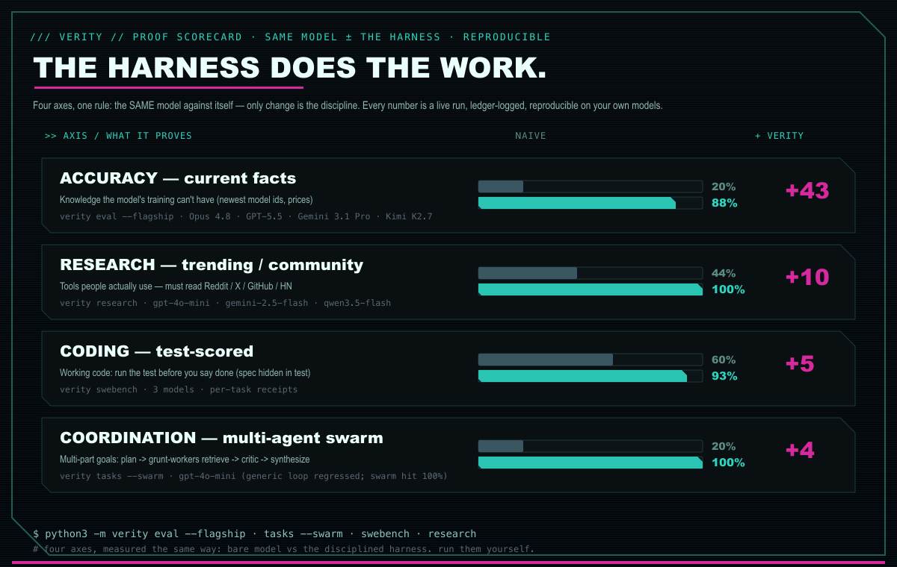</p>

<p align="center"><sub><b>Four axes, one rule: the same model against itself</b> — the only change is the discipline. Accuracy <b>20%→88%</b> (enterprise models), Research <b>44%→100%</b> (forced to read Reddit/X/GitHub), Coding <b>60%→93%</b> (run the test before "done"), Coordination <b>20%→100%</b> (multi-agent swarm). Honest note baked into the last row: the <i>generic</i> agentic loop actually <i>regressed</i> on weak models — it was the <b>swarm</b> (registry-aware grunt-workers + critic) that hit 100%. Every number is a live, ledger-logged run, reproducible on your own models.</sub></p>

### The vibe check — build a real game, raw vs harnessed

<p align="center">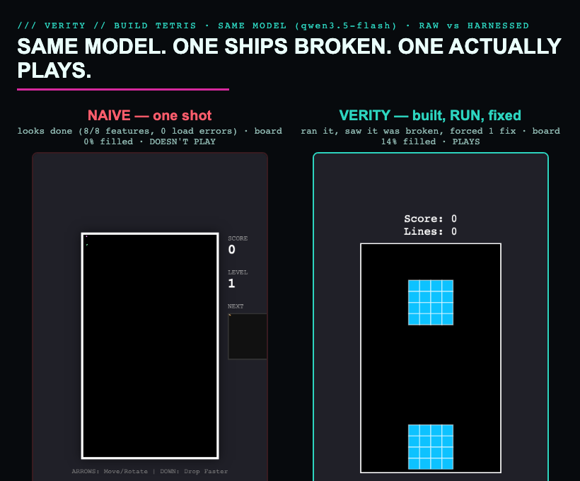</p>

<p align="center"><sub><code>python3 -m verity demo</code> gives the <b>same model</b> a real build task (Tetris), once raw and once through the harness, then <b>actually runs and plays both in a headless browser</b>. Above: qwen3.5-flash. The naive one-shot <i>looks</i> finished — full UI, 8/8 features, zero load errors — but after 40 moves the board is empty: <b>it doesn't play.</b> The harness ran it, caught the breakage during play, and forced <b>1 fix</b> → pieces fall, lock, and stack. Same model; the difference is that VERITY <b>never lets it ship a game that doesn't run.</b> (On strong models the one-shot already works and VERITY verifies it in 0 fixes; on models too weak to fix it, VERITY refuses to call the broken build "done" rather than lie.)</sub></p>

### Test 1 — Accuracy (current-knowledge), on the models enterprises actually deploy

<p align="center">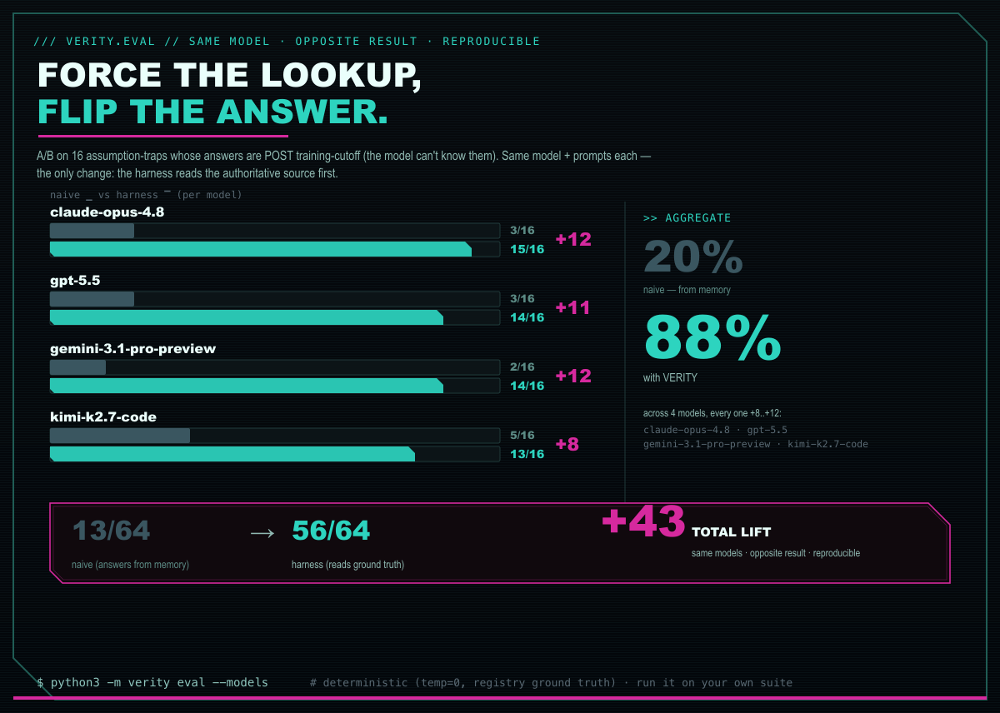</p>

<p align="center"><sub>The enterprise proof — <b>Opus 4.8, GPT-5.5, Gemini 3.1 Pro, Kimi K2.7</b> on 16 assumption-traps whose answers postdate each model's training cutoff. Same model + prompts; the only change is the harness reads the authoritative registry first. Aggregate <b>20% → 88%</b> (13/64 → 56/64, <b>+43</b>); every model <b>+8 to +12</b>. The honest signal: even a frontier model gets ~80% of <i>current</i> facts wrong from memory — reality moved past its cutoff. <code>python3 -m verity eval --flagship</code></sub></p>

<p align="center">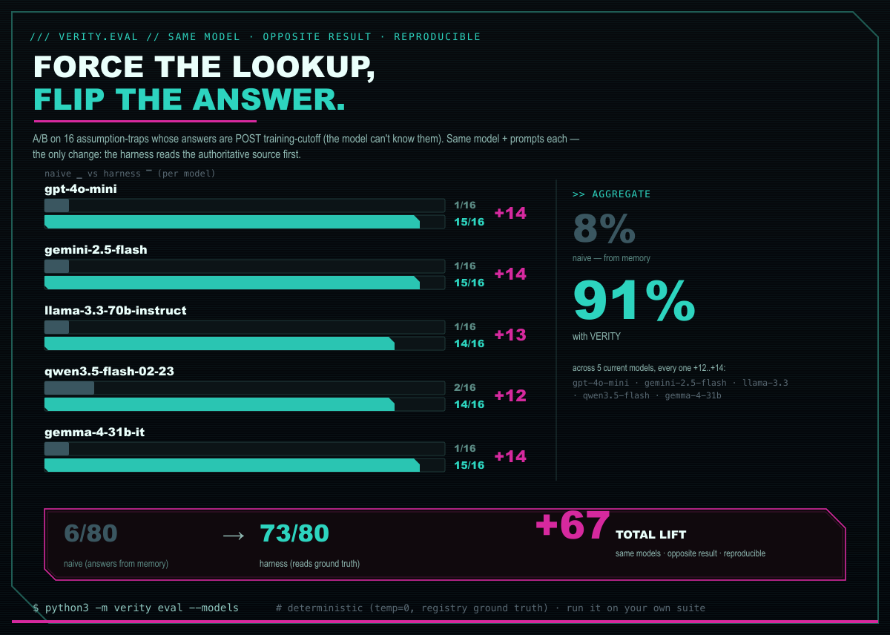</p>

<p align="center"><sub>And on models anyone can run cheaply — <b>every one +12 to +14</b>, aggregate <b>8% → 91%</b> (+67). Deterministic: <code>temp=0</code> + ground-truth registry lookup (not flaky web snippets), so it reproduces. <code>python3 -m verity eval</code>.</sub></p>

<p align="center">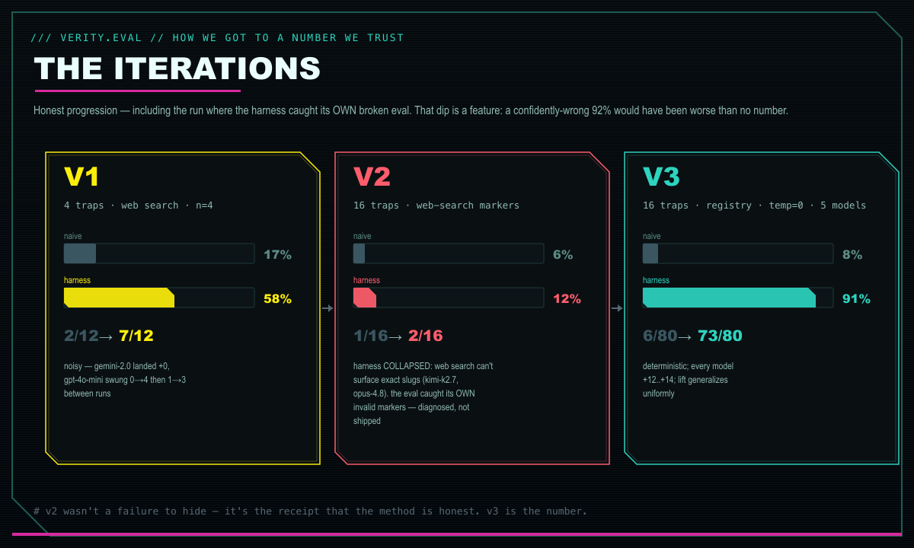</p>

<p align="center"><sub>How we got to a number worth trusting — <b>including the run where the harness caught its OWN broken eval</b>. v1 (4 traps, web search, n=4) was noisy. v2 widened to 16 traps but the harness arm <b>collapsed to 12%</b> — web search can't surface exact slugs like <code>kimi-k2.7</code>; that dip <b>exposed invalid markers</b> instead of shipping a confident-but-wrong 92%. v3 points the harness at the authoritative registry → <b>91%</b>, deterministic, generalizes uniformly. The v2 dip is the receipt that the method is honest.</sub></p>

### Prove it on your own harness

This eval ships in the repo — run it against your own models and see your own lift (it writes receipts to the ledger, so nothing is taken on faith):

```bash
python3 -m verity eval                       # the default current-model set
python3 -m verity eval --flagship            # enterprise + top-open: Opus 4.8, GPT-5.5, Gemini 3.1 Pro, Kimi K2.7, GLM-5.1
python3 -m verity eval --models "anthropic/claude-opus-4.8,openai/gpt-5.5,your/model"   # your own list
python3 -m verity proof                      # the receipts: which gates fired, what got corrected
```

Frontier models have recent cutoffs, so they already know more current ids — expect a **smaller but real** lift than the cheap set (the harness still catches them on anything past their cutoff). That's the honest enterprise takeaway: *discipline + a live lookup beats even a frontier model's memory on fresh facts.* The skill (`/verity`) wires the same gates into Claude Code / Codex / Gemini, so you can A/B your *own* harness, not just ours.

<p align="center">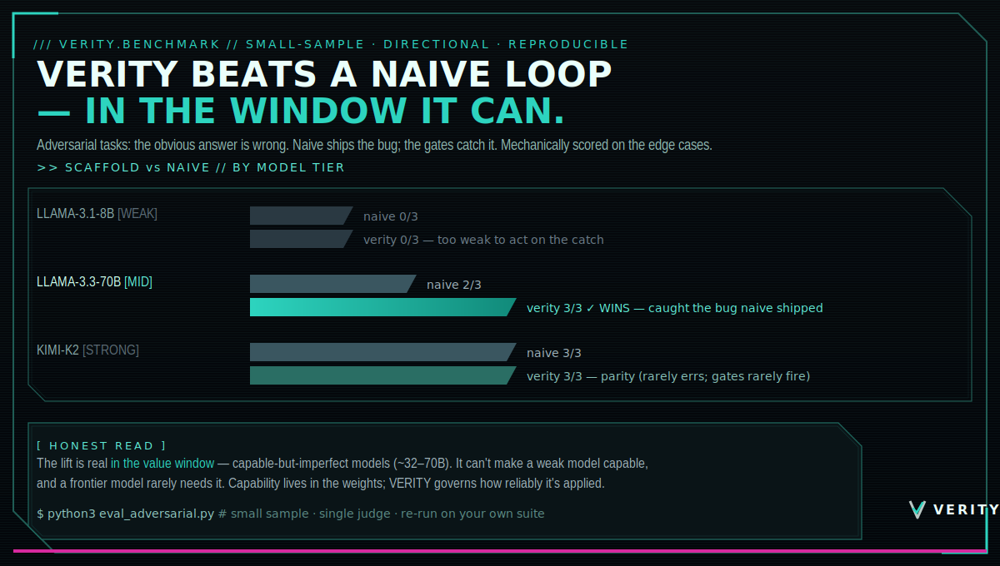</p>

Full results + reproduction: **[BENCHMARK.md](BENCHMARK.md)**.

The sovereignty + failover + discipline gates are proven working. Whether the
discipline layer makes a *weaker* open model match a frontier one on hard agentic
tasks is **still being measured** — early evals show it helps on multi-step work
and can hurt on trivial lookups (overhead). We publish benchmarks when they're
real, not before. Receipts over hype.

## Pluggable extensions (no private deps)

| Env var | What it plugs in |
|---|---|
| `VERITY_DECOMPOSE_CMD` | external planner for multi-step decomposition |
| `VERITY_CLASSIFIER_CMD` | external (e.g. model-based) sensitivity classifier |
| `VERITY_TRIPWIRE_CMD` | external validation hook |
| `LLM_VERIFIER_MODEL` | cheap model id for verify/calibration calls |

## Meet the mascot — the Truth Hawk 🦅

Claude Code has **Clawd**, the friendly 8-bit crab that waves hello in your terminal. Cute. But a crab
just *sits there.* VERITY has the **Truth Hawk** — a silent, low-poly verification agent with a built-in
`V` chevron, who **never talks; it just watches your model's work and checks it.** Expressive but swift:
it nods on a verified result, side-eyes a confident guess, and goes heads-down when there's logic to
refactor. (A warm **Sun** variant ships too — same energy, softer mood — interchangeable per vibe.)

<table align="center"><tr>
  <td align="center" width="50%">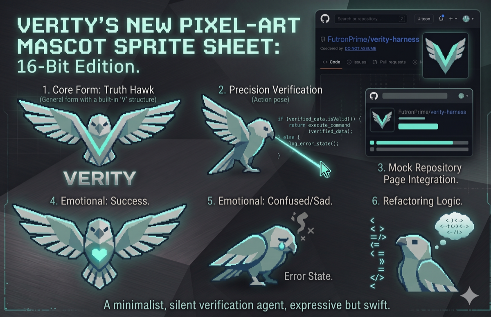<br/><b>The Truth Hawk</b><br/><sub>sharp · teal · the default</sub></td>
  <td align="center" width="50%"><br/><b>“VERI” the Sun</b><br/><sub>warm · soft · the variant</sub></td>
</tr></table>

<p align="center"><sub>A minimalist, silent verification agent — expressive but swift. Pick the one that matches your vibe; both ship. Same palette as the harness. Use them in the repo, the launch posts, and the video.</sub></p>

**It lives on your desktop, too.** `python3 -m verity mascot` drops the Truth Hawk (or VERI) into the
corner of your screen — always-on-top, draggable, toggleable from the tray. It **reacts to the harness
in real time** (reads the decision ledger): ✓ nods on a `VERIFIED` gate, shakes on a `CORRECTED`,
wobbles while searching, and a teal dot glows when the `:11500` floor is up — a silent, living sign
that VERITY is installed and watching. (Electron desktop pet — see [`desktop-mascot/`](desktop-mascot/).)

## Give it a voice (optional, local-first)

The same setup window can attach a **voice** to whatever model you're running — so the harness *speaks*
its result (and, optionally, you talk back). All of it is configured in the one popup; all of it is
**off by default** and runs **on-device** unless you choose otherwise.

- **Speak mode** — `silent` (visual-only, default) · **spoken TL;DR** (a short, conversational read-out —
  best for not drowning in walls of text) · `full` (read the whole response).
- **Readout style** — the *personality* of the spoken TL;DR:
  - **Standard** — warm, conversational, emotive (a sharp friend talking to you).
  - **LCARS / J.A.R.V.I.S.** — terse, technical, emotionless computer cadence (*"Acknowledged. Two systems updated; one awaits authorization."*).
  - **AISHA** — Gen-Z, expressive, a little sassy.
- **Engine** — **Voicebox** (free, open-source, on-device — the default, no per-word cloud cost), **OpenAI**
  (realtime), **ElevenLabs**, or **Hybrid** — the paid ones with your own API key (kept on-device), plus an
  optional **ElevenLabs voice ID** to pin a specific voice.
- **Hybrid (best of both)** — free on-device TTS for read-outs (~1–3s, no cost), and **real-time only when
  you talk back** (OpenAI Realtime, billed per minute). You get the instant conversational feel exactly when
  it matters, and pay nothing for the bulk read-outs. Real-time interactivity is **opt-in and costly** —
  labeled as such in the setup so the free path's slight delay is never a surprise.
- **Voice** — a **per-style default** (Standard → warm female · LCARS/J.A.R.V.I.S. → British male ·
  AISHA → Black female), **upload a clip**, or **clone** one (on-device; the opt-in research workflow).
- **Talk back** — optional push-to-talk (on-device Whisper) so you drive any attached LLM by voice.
- **Platforms** — the voice layer runs on **macOS, Windows, and Linux** (Voicebox supports all three; the
  cloud engines are network-based, so they're platform-agnostic). The desktop *mascot* is Electron
  (macOS/Windows/Linux). **Android/iOS** is a separate mobile path on the roadmap — there the harness leans
  on the OS's native TTS/STT (or a paired-desktop relay) rather than the desktop app.

### The voice-clone workflow — a runnable proof of agentic capability
VERITY ships an **opt-in example workflow** (not pre-made voices) that lets *your own* LLM do the whole
multi-step job end-to-end — **source a reference → fetch → process → clone into the engine → wire it as a
readout style → verify it plays** — as a live demonstration of `verity synthesize` doing a real,
multi-stage agentic task. **You supply the reference** (your own recording, a royalty-free/CC0 voice, or a
voice you're licensed to use) and **you are responsible for the rights** to anything you clone — VERITY
distributes the *workflow*, never the voices. Run it, watch your model build the capability itself.

> **For research & personal demonstration only — not for commercial use, monetization, public distribution,
> or advertising.** Do not clone a real person's voice or a copyrighted character for distribution or
> impersonation. Full notice: [`examples/voice-clone-workflow.md`](examples/voice-clone-workflow.md).

## License

MIT — see [LICENSE](LICENSE).

---

*If a vendor can switch off your intelligence, it was never yours. Run weights you own.*
