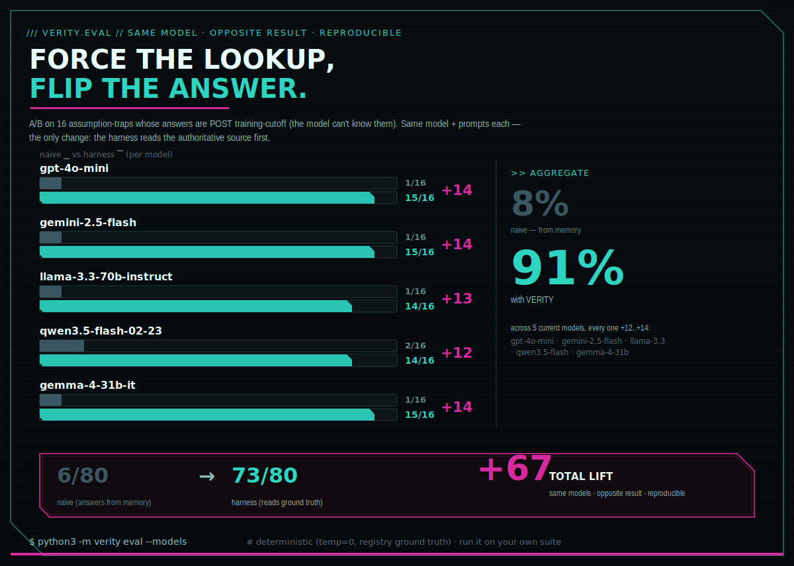
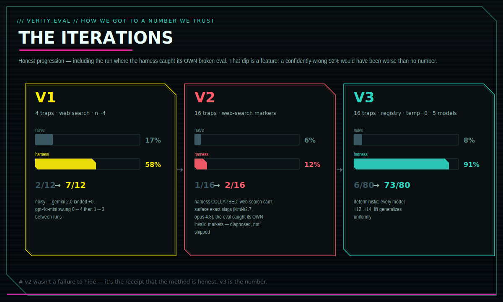

<p align="center">
  
</p>

# VERITY · The Truth Harness

> **Fable tells the tale. Verity verifies it.**

### The open-source, model-agnostic Fable killer.

Make the models you **own** — a local 8B *or* a frontier flagship — verify, self-correct, and punch
above their weight. Anthropic's **Fable** and **Mythos** can be banned, suspended, or priced out
overnight; VERITY puts that *kind* of disciplined capability into weights **you** control, today.
Measured: across **5 current models** (gpt-4o-mini, gemini-2.5-flash, llama-3.3-70b, qwen3.5-flash,
gemma-4-31b) it lifted current-info accuracy **8% → 91%** — *every* model **+12 to +14**, deterministic
— by forcing one rule: *check your work, adversarially, before you're allowed to say "done."* (That check can run on a separate/cheaper model, or — for a single-model or local-only setup —
the **same** model in a fresh discrimination-mode pass; the bias-free separate model is an opt-in
upgrade, not a requirement. Honest counter-point kept throughout: on tasks a model already aces
one-shot, the lift is ~0 — VERITY helps where a model **needs** help, not where it doesn't.)

**Don't let any single vendor hold your AI hostage — and don't let any model
proceed on confident guesses.** A zero-dependency harness that (1) survives a
vendor vanishing overnight by failing over to open weights you own, and (2)
wraps *any* model in a discipline layer that **forces** it to verify instead of
assume, persist instead of quit, and reuse instead of reinvent.

*Where Anthropic's **Mythos** and **Fable** are named for fiction, **Verity** is
named for truth — and it **verifies**. The name is the thesis.*

> A vendor's access can be suspended overnight. It cannot reach into open weights
> you already pulled to local disk. **That** is sovereignty.

In June 2026 a frontier model was suspended globally with ~3 days' notice. Anyone
who'd built on it as a single point of failure was stuck. This is the answer to
"what happens to my system if my provider vanishes at 2am?" — *and* to "how do I
stop my agent from confidently shipping wrong answers?"

## Two things, both rare

**1. Sovereignty** — automatic, silent failover from cloud → local open weights.
**2. A discipline layer** — verify · evidence-gate · **calibration / anti-overconfidence** · configurable guardrail. This is the differentiator: almost nothing else has an anti-overconfidence gate that makes a model *prove it's not guessing*.

## Autonomy with a spine

VERITY agents don't just *answer* — they **work**, and they **don't give up**:

- **Research before acting** — live-search the current best approach for the exact goal (find, don't
  recall). Stale weights stop being the ceiling.
- **Verify in discrimination mode** — re-checked adversarially by a *separate*/cheaper model, or (single-
  model & local-only setups) the **same** model in a fresh "did this REALLY work? prove it" pass — never
  self-grading in generation mode. "Done" must clear an evidence gate, a calibration / anti-overconfidence
  gate, and (opt-in) an **objective test** that has to exit 0.
- **Self-correct & persist** — on a wall, they research the *obstacle itself* (GitHub / Reddit / X /
  StackOverflow) and force a **different** approach instead of quitting or head-bumping.
- **Automate through blockers** — drive a browser / automation to get past what stops a one-shot call,
  so long, multi-step tasks actually *finish*. ("It's impossible / only a human can" is a **forbidden
  conclusion** until they've actually read the logs, tried the repair, and searched for the fix —
  enforced mechanically by a Stop-hook + a server-side guard, not the model's goodwill.)
- **Know which models exist** — `verity models <provider>` reads the live OpenRouter registry, so the
  harness *looks up* current model ids instead of guessing stale ones from training. ([MODELS.md](MODELS.md))
- **Multi-agent swarm** — `verity swarm` fans out research + execution, runs an adversarial critic, and
  synthesizes — every step gated, **every sub-agent the same caliber as the lead and bound by the same
  gates** (can't quit, can't confabulate model facts). ([details below](#multi-agent-swarm-the-mythosfable-shape--self-contained))

This isn't a personality prompt asking the model to be diligent; it's enforced on **code conditions**.

> **The discipline layer for the meta-harness era.** The hard lesson of 2026 (sharpened by the Fable
> ban): *the harness matters as much as the model — maybe more.* "Meta-harnesses" now orchestrate
> several agents together (one implements, another reviews). VERITY is the **reliability layer that
> makes any of them trustworthy**: it injects the same gates into Claude Code, Codex, and Gemini, and
> gates every OpenAI-format agent through the `:11500` proxy — so whether you run one agent or a whole
> pyramid of them, none gets to confidently ship a guess or quit on a wall. If the model can't get
> better, you make the system around it stronger. That's the whole bet.

## 100% self-contained

- **Zero pip dependencies.** Pure Python stdlib. The thing that protects you from
  a vendor being yanked must not break because a PyPI package was yanked.
- **One-command setup.** `bash setup.sh` installs [Ollama](https://ollama.com) +
  pulls a local model (your sovereign floor) and detects any cloud key. No other
  system, account, or service required.
- **Runs fully local** if you have no cloud key at all. That's the point.

```bash
git clone https://github.com/<you>/verity-harness && cd verity-harness
bash setup.sh                              # installs Ollama + a model; no pip needed
python3 -m verity tiers         # show routing order
python3 -m verity failover-test # PROVE: cloud down → local floor answers ✅
```

Optional cloud tier (frontier-class while available): `export LLM_TIER1_API_KEY=<key>`
(OpenRouter gives one key → hundreds of models).

## Architecture

<p align="center">
  
</p>

> 📐 **Full walkthrough:** [ARCHITECTURE.md](ARCHITECTURE.md) — stage-by-stage breakdown, an editable
> Mermaid flow, how it lifts top-end enterprise LLMs (with measured numbers + honest limits), and bulletins.

```
TIER 1   a CHAIN of peer frontier models      ← capability-preserving failover
   │     Opus 4.8 → GPT-5.5 → Gemini 3.1 …        (LLM_TIER1_MODELS, one key via
   │     each self-retries, then → next peer       OpenRouter or a local shim)
   ▼     all peers exhausted → drop to floor
TIER 0   open weights via Ollama (localhost)  ← SOVEREIGN FLOOR, un-revocable
         llama3.2 / qwen2.5 / deepseek on YOUR disk     (last resort, never first)

        ── wrapped in the metacognitive discipline layer ──
   PRE-FLIGHT (research current best approach) → think → act → VERIFY →
   recover → CALIBRATE (challenge before concluding) → SEARCH-before-any-"can't"
   + persistent memory across runs   + decision ledger (auditable receipt)
```

> **The core idea:** it's not a smarter model — it *forces a mediocre-but-capable model
> to behave like a great one.* Before acting, it makes the model admit what it doesn't know
> and **go fetch the current best answer from the live world** (GitHub/Google/Reddit/X/YouTube).
> Mythos/Fable felt like magic because they *reliably did the right thing*; this makes the
> right thing **non-optional** (the gates fire on code, not the model's goodwill) and
> **measurable** (`verity proof` + `verity eval`).

## The discipline layer (why it's different from "just route to an LLM")

<p align="center"></p>

**A prompt *requests* discipline; a gate *enforces* it.** Because LLMs are
probabilistic, every behavior below fires on a *code condition* the harness
controls — never the model's choice to remember.

```python
from verity.scaffold import run_verified
from verity.loop import ShellExecutor

r = run_verified("find and fix the off-by-one bug in utils.py",
                 executor=ShellExecutor())   # think→act→verify→recover→calibrate
```

- **🧠 Metacognitive pre-flight gate** *(fires first)* — before executing a goal, the harness
  live-searches the **current best/established approach** and injects it (*"may supersede your
  training — prefer it"*). The model stops *recalling* from finite, stale weights and starts
  *finding + applying* the current best answer. **This is the lever that lets a weaker model
  punch up** — pinpoint live world-knowledge beats a stronger model's old priors. It turns the
  whole internet into the model's knowledge base.
- **🔎 Search-before-concluding gate** — a *negative* claim ("there's no X", "not possible",
  "no free option") is the most expensive assumption. Before any such claim stands, the harness
  forces a search where solutions live. *(Live example: "X has no free posting API" → forced
  search → `twikit`, which posts free. The model had asserted the opposite from memory.)*
- **Verify gate** — after each action, an adversarial check: *did this really work?*
  Catches failed commands an optimistic loop would rubber-stamp.
- **Evidence gate** — refuses to declare "done" on a fact question with zero
  verified evidence. No answering from vibes.
- **Calibration gate** — before accepting a confident conclusion, challenges it:
  *what unverified assumptions does this rest on, and what would make it wrong?*
  Routes the check to a cheap model (verification is discrimination, not generation).
- **Memory** — remembers verified outcomes across runs (`~/.verity-harness/`),
  surfaces "you've done something like this before."
- **QC self-heal** — tool results are quality-checked: garbage (CAPTCHA/empty/error) is
  *dropped* instead of fed to the model as "findings", and a 5-block ErrorHandlingProtocol
  (What/Why/Impact/Fix/Prevention) journals every failure so the harness fixes its own plumbing.
- **Autonomy gate** — once told "proceed / do this / do all of this", execute EVERY stated goal
  consecutively and autonomously to completion; don't stop to re-ask for confirmation (it wastes
  the user's time). Pause only for genuinely destructive, ambiguous, or outward-facing actions.
  (Injected as standing context for Anthropic-format agents that can't route through the proxy.)
- **Objective completion gate** *(opt-in: `solve --gate "<cmd>"`)* — when you supply a real
  test/build/lint command, **`done` is rejected until that command exits 0**. The maker doesn't get
  to declare victory — an exit code does. This is the *loop-engineering* lesson in code: a stop
  condition that's an LLM opinion is "a second optimist"; a passing test is a gate. Defeats the
  **Ralph-Wiggum loop** (agent emits the completion token on a half-done job).
- **Hard-stop gate** *(`solve --deadline <seconds>`, plus the always-on `max_steps` iteration cap)* —
  a loop with no kill-switch "runs until someone notices the bill." Wall-clock + iteration give two
  of the three classic kill-switches (the third, token budget, is the tier layer's job). Long runs
  also get a periodic **goal reanchor** so constraints don't drift away over many steps.

## Reading the walled web (X posts & Articles, no API key)

The search-before-concluding gate is only as good as the agent's *reach*. "I can't read that page"
is usually a premature negative — so VERITY ships a real reader:

```bash
python3 -m verity x-read "https://x.com/<user>/status/<id>"   # tweet OR long-form Article
python3 -m verity x-read "https://x.com/i/article/<id>"        # the bare article permalink
```

- **Status form** (`/<user>/status/<id>`, `/i/status/<id>`, bare id) → read **fully, no auth, no
  key** via the FxTwitter mirror. Long-form Articles included (their body lives in
  `article.content.blocks`, not the empty `text` field — auto-extracted). This is ~95% of shared links.
- **Bare article permalink** (`x.com/i/article/<id>`) → the article id isn't a tweet id and has **no**
  no-auth path (verified across 7 backends). So VERITY reads it through **your own logged-in browser
  session**: it auto-discovers the X cookie (env `TWITTER_AUTH_TOKEN`+`TWITTER_CT0` → config →
  decrypted from Chrome, **scanning every profile**) and renders the page in a cookie-injected
  headless browser. Cookies stay **local — nothing is uploaded**. With no session it returns an
  *honest, actionable* next step (paste the status URL, or log in) — never a bare "unreadable".

This render path is the **one optional extra** (Playwright + cryptography). The core stays
zero-dependency; enable the reader once with:

```bash
python3 -m verity web-setup      # installs Playwright + Chromium into an isolated venv
```

VERITY auto-detects that venv and runs the render **out of process**, so the harness itself stays
pure-stdlib. (For other walled platforms — Reddit, YouTube, Bilibili, LinkedIn — pair with
[Agent Reach](https://github.com/Panniantong/Agent-Reach), a multi-backend router VERITY surfaces
via `system_web_tools()`.)

## Multi-agent swarm (the Mythos/Fable shape — self-contained)

A single disciplined model is good; a **swarm of specialized disciplined agents** is the shape
that frontier agentic systems get their power from. VERITY ships it natively, **zero external
dependencies**. Every sub-agent is **assimilated, not downgraded** — it runs through the **same tier
as the lead** (Opus→Opus, a local 4B→4B, the critic often sharper than the original — the
Agent-Smith property), and inherits the **full discipline stack**: `PRIME_DIRECTIVE` + a reiteration
that it must not quit/defer/hedge and must read the registry for model facts, plus the **same
overconfidence/anti-giveup guard the main loop uses** (a sub-agent that tries to punt is re-prompted,
not allowed to). For model-id questions it reaches the **authoritative registry** too, so sub-agents
share the lead's knowledge access — no confabulated "Kimi V4." Each agent is a role-prompted call,
but bound by every gate:

```bash
python3 -m verity swarm "research and recommend the best approach to X"   # add --exec for real shell
```
```
PLAN  →  decompose the goal into independent sub-tasks
  ↓      (parallel — one worker per sub-task)
RESEARCH → pre-flight live-search the current best approach
EXECUTE  → do it under verify + QC gates
CRITIQUE → an adversarial CRITIC agent reviews; one repair pass on issues
  ↓
SYNTHESIZE → combine the verified sub-results → final answer (VERIFIED vs GUESS tagged)
```
Every step is gate-disciplined and logged to the ledger. A fresh `git clone` runs the full swarm
with **no knowledge of any private tooling** — that's the point: same system, same results, for
anyone who installs it.

## Invisible, always-on (proxy daemon)

Point any OpenAI-compatible client (Claude Code, Cursor, an SDK) at the proxy and
it inherits failover + guardrail transparently:

```bash
python3 -m verity.server                 # → http://127.0.0.1:11500/v1
export OPENAI_BASE_URL=http://127.0.0.1:11500/v1     # your client now has a floor
```

## Configurable guardrail (off by default for local sovereignty)

On your own hardware, a router shouldn't nanny your reasoning — default mode is
`off` (neutral passthrough). Operators of shared/hosted deployments opt in:

```bash
export VERITY_GUARDRAIL_MODE=standard   # dual-use → safest tier; capability-forward on benign
export VERITY_GUARDRAIL_MODE=strict     # + hard-refuse catastrophic categories
```

The harness **never strips a model's own safety** in any mode — `off` just declines
to *add* a gate; it does not attack the model's alignment.

## Safety posture (non-negotiable)

Buys **resilience**, not lawlessness. Does **not** bypass, disable, or circumvent
any model's safety systems, and is **not** a tool for accessing restricted or
export-controlled models. It runs **openly available** open-weight models you are
entitled to run, alignment intact. Sovereignty ≠ jailbreak.

## Model requirements (read this — the harness has a floor)

This harness adds **reliability** to a capable model; it does **not** make a weak
model capable. Evidence-based floor: **~32B+ open-weight** or any **frontier API**.
Below ~13B, the gates catch errors but the model can't fix them. Full detail +
disclaimer: **[REQUIREMENTS.md](REQUIREMENTS.md)**. Test YOUR model:

```bash
python3 -m verity doctor    # → READY / MARGINAL / BELOW THRESHOLD
```

## Honest status

<p align="center"></p>

<p align="center"><sub>Live <b>5-model</b> A/B on <b>16</b> assumption-traps whose answers are post-training-cutoff (the model can't recall them). Same model + prompts each — the only change: the harness reads the authoritative source first. <b>Every model lifted +12 to +14</b> (gpt-4o-mini, gemini-2.5-flash, llama-3.3-70b, qwen3.5-flash, gemma-4-31b); aggregate <b>8% → 91%</b> (6/80 → 73/80, <b>+67</b>). Deterministic: <code>temp=0</code> + ground-truth registry lookup (not flaky web snippets), so it reproduces. <code>python3 -m verity eval</code>.</sub></p>

<p align="center"></p>

<p align="center"><sub>How we got to a number worth trusting — <b>including the run where the harness caught its OWN broken eval</b>. v1 (4 traps, web search, n=4) was noisy. v2 widened to 16 traps but the harness arm <b>collapsed to 12%</b> — web search can't surface exact slugs like <code>kimi-k2.7</code>; that dip <b>exposed invalid markers</b> instead of shipping a confident-but-wrong 92%. v3 points the harness at the authoritative registry → <b>91%</b>, deterministic, generalizes uniformly. The v2 dip is the receipt that the method is honest.</sub></p>

<p align="center"></p>

Full results + reproduction: **[BENCHMARK.md](BENCHMARK.md)**.

The sovereignty + failover + discipline gates are proven working. Whether the
discipline layer makes a *weaker* open model match a frontier one on hard agentic
tasks is **still being measured** — early evals show it helps on multi-step work
and can hurt on trivial lookups (overhead). We publish benchmarks when they're
real, not before. Receipts over hype.

## Pluggable extensions (no private deps)

| Env var | What it plugs in |
|---|---|
| `VERITY_DECOMPOSE_CMD` | external planner for multi-step decomposition |
| `VERITY_CLASSIFIER_CMD` | external (e.g. model-based) sensitivity classifier |
| `VERITY_TRIPWIRE_CMD` | external validation hook |
| `LLM_VERIFIER_MODEL` | cheap model id for verify/calibration calls |

## License

MIT — see [LICENSE](LICENSE).

---

*If a vendor can switch off your intelligence, it was never yours. Run weights you own.*
